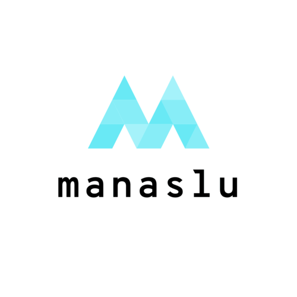

<div align="center">
  
</div>

<p align="center">
  <a href="https://skillicons.dev">
    
  </a>
</p>

<p align="center">
  
  
  
  
</p>

# Introduction

manaslu is a boilerplate for developers using **Next.js** and **NestJS** in **monorepo**.  
convenient workflows and utility tools help developers climb that distant mountain.  
come on, let's get over that mountain together!

# Usage

### create repository

press the button `Use this template > create a new repository`.

### git clone

```powershell
git clone "https://github.com/your-name/your-repository"
```

### launch conatiner

```powershell
docker compose -f ./docker/docker-compose.development.yml -p manaslu up -d
```

### setup mongodb

```powershell
docker compose -f ./docker/docker-compose.development.yml -p manaslu exec mongo mongosh --eval "rs.initiate({_id: 'rs-manaslu', members: [{_id: 0, host: 'mongo:27017'}]});"
```

### set env variables

- `APOLLO_KEY`
- `CHROMATIC_PROJECT_TOKEN`
- `NEXT_PUBLIC_GRAPHQL_ENDPOINT`
- `NEXT_PUBLIC_WS_ENDPOINT`
- `PAT`

# Use Cases

- https://github.com/dino3616/shio
